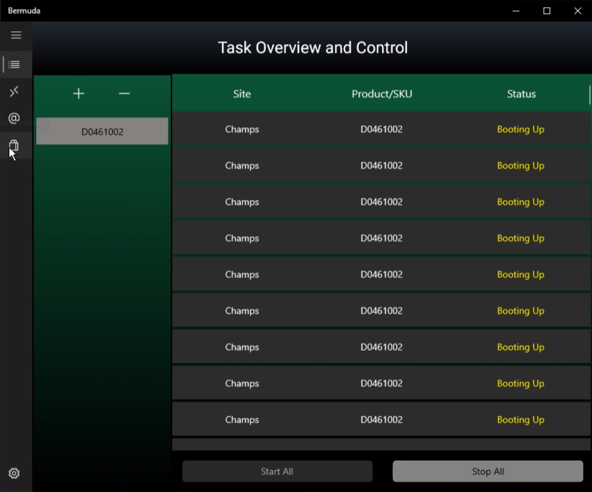
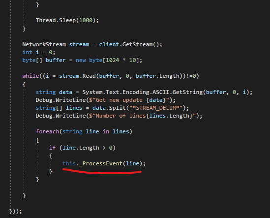
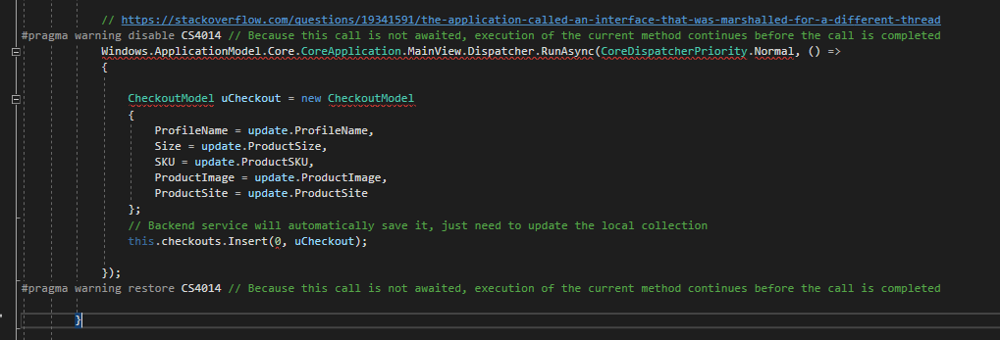

[![LinkedIn][linkedin-shield]][linkedin-url]

<!-- PROJECT LOGO -->
 

  <h3 align="center">C#, UWP, and WinUI Desktop Application</h3>
  

    Building a responsive and functional UI for automating bulk-orders of highly requested retail products (Clothing, Shoes, Sports Goods) on Windows.
     
  

<!-- ABOUT THE PROJECT -->
## About The Project

One big inspiration of mine and a personal role-model is Bill Gates and Microsoft as a company. Recently, they released a native Windows UI development framework called **WinUI 3.0** - it aims to be the technology behind all next-generation windows apps built. In-fact, most of the apps you see on the Windows Store, are built using WinUI! Furthermore, **.NET MAUI** has gotten many C# developers interested for the future of .NET UI development.

One significant driving force behind this technology is WPF (Windows Presentation Framework). WPF has been around since early 2000s and is still actively used in many native applications to date, Windows Developers aren't really satisfied with this and need something modern.

For more information about WinUI, please visit their official documentation which contains technicals as well as Microsoft design philosophy!

https://docs.microsoft.com/en-us/windows/apps/get-started/?tabs=net-maui%2Ccpp-win32

**Note:** I have only published the frontend code for this project, the backend logic has been sold off.

What are the objectives of this application:
* Create a beautiful desktop application which uses WinUI to accomplished desired functionality of the customer.
* Allow for thousands of updates on the UI in real-time using delegates and multi-threading.
* Build frameworks to allow for continuous deployment (CD) and reduce redundant activities when pushing out releases.

(<a href="#readme-top">back to top</a>)

### Built With

This project was built with the following technologies:

1. C#: 
  
2. WinUI 3.0: 

3. XAML: 

(<a href="#readme-top">back to top</a>)

<!-- ROADMAP -->
## Features Checklist

- [x] Design pages using XAML (Licensing, Profiles, Billing, Settings, Overview)
- [x] Design modals using XAML (Create profile, Create billing)
- [x] Use Delegates to push real-time notifications to the UI (from another Daemon)
- [x] Implement an MVVM structure in Code
- [x] Create an interface to communicate with the backend Daemon (another language)

 

(<a href="#readme-top">back to top</a>)

## Interesting Challenges

Prior to working on this project, I was only really familiar with an MVC (Model - View - Controller) type application. However, while studying, I came across something called the MVVM model (Model - View - View Model) structure. Illustrated below:

 

The backend daemon runs as another process on the OS and was written in C++ for specific purposes. Messages are sent back and forth between the UI and Backend via a socket tunnel established in the Backend Service (Services/BackendService.cs).

**Bug & Solution:**
Interestingly, there is something called thread-affinity where you can only publish UI updates from the thread that manages that resource. I tried using 2-way binding to properly update the UI states, but for some reason it wasn't updating. To solve this I had to write code that would manually change the state of a task. Illustrated below:

https://stackoverflow.com/questions/19341591/the-application-called-an-interface-that-was-marshalled-for-a-different-thread

(<a href="#readme-top">back to top</a>)

<!-- ACKNOWLEDGMENTS -->
## Acknowledgments

Also I would like to thank Alvin Ashcraft for publishing one of the very first WinUI 3.0 books (Learn WinUI 3.0):
https://www.alvinashcraft.com/

(<a href="#readme-top">back to top</a>)

<!-- MARKDOWN LINKS & IMAGES -->
[linkedin-shield]: https://img.shields.io/badge/-LinkedIn-black.svg?style=for-the-badge&logo=linkedin&colorB=555
[linkedin-url]: https://www.linkedin.com/in/ibrahim-element-7bb674213/
